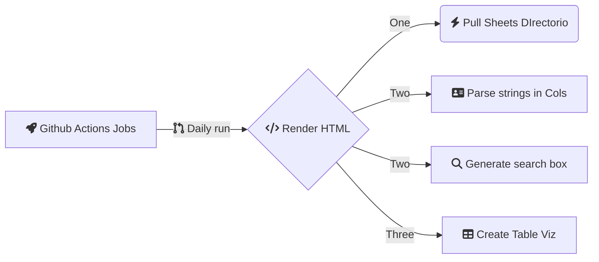

# directorio-polyfriendly-app

repositorio para hostear una pagina para revisar el directorio elaborado por La Maliana

## Objetivo

Presentar de una forma interactiva y sencilla un [directorio de terapeutas polifriendly curado por La Maliana](https://docs.google.com/spreadsheets/d/1Kc_kCvysiwwWssyRsgtmAvx2HeB0WcAW0MagakIwORY/htmlview).

## Plan

 - v1: establish automation with workflow to a static website hosted by github pages
 - v2: add [shiny infine scroll](https://github.com/dar4datascience/shiny-infinite-scroll/tree/master/R) to transform static site to shiny app hosted in shinyapps

## Tools

R programming language:
 
 - [rmarkdown](https://rmarkdown.rstudio.com/)
 - [googlesheets4](https://googlesheets4.tidyverse.org/)
 - [shiny](https://shinydevseries.com/)
 

# Workflow v1

GIthub actions jobs 2 github pages: a simple but powerful table

